# Project_Dogs_vs_Cats
Keras is used in this project to build CNN or reuse pretrained networks. Using a pretrained network normally consists of feature extraction and Finetuning.

## Data Set Exploration
Training set image size.
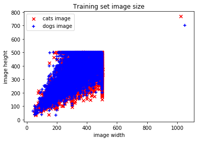
Possible abnormal values for cat images in training set.
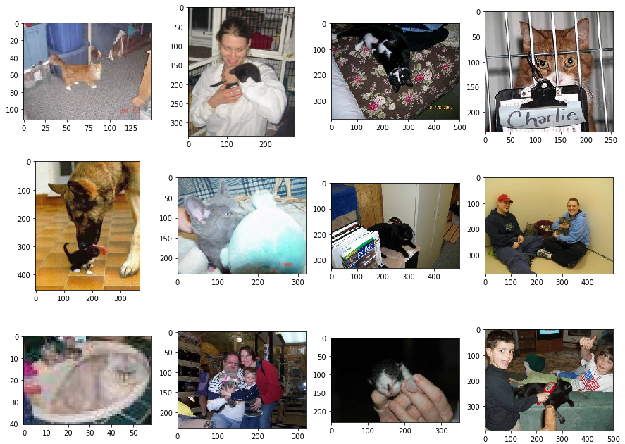
Possible abnormal values for dog images in training set.
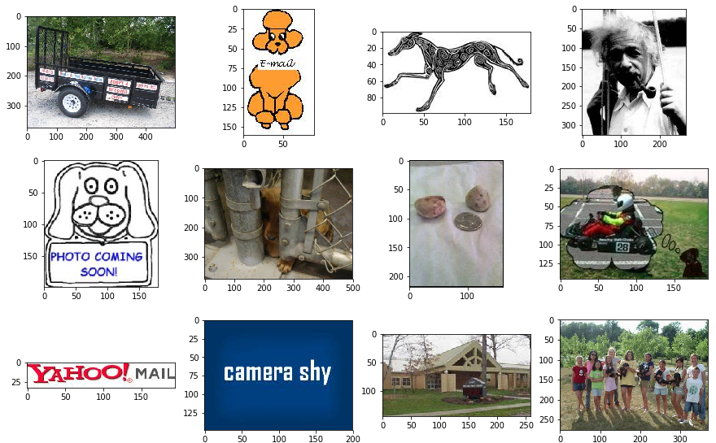

## Basic Model
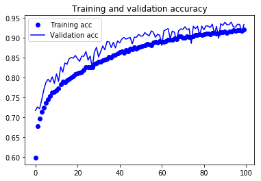
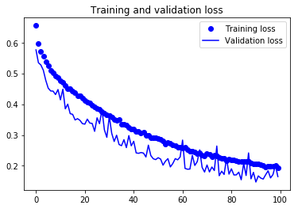

## Pre-trained Model Finetuning
### VGG16
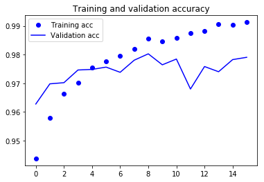
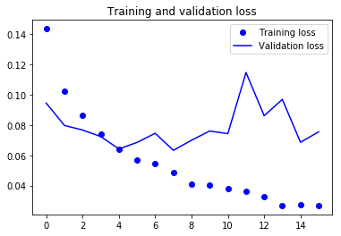

### GoogLeNet (InceptionV3)
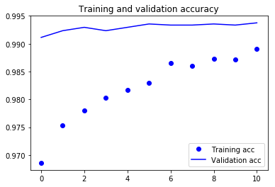
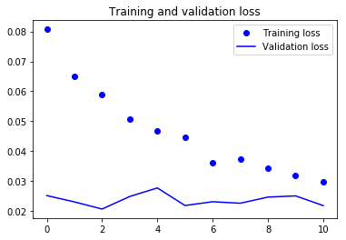

### ResNet50
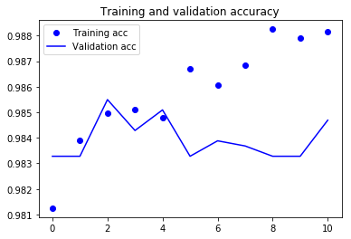
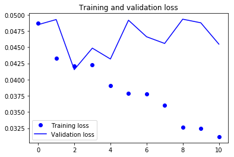

### Xception
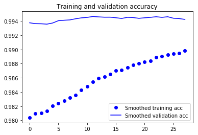
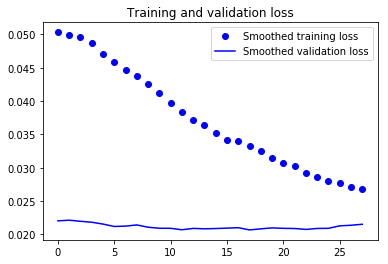

## Feature Integration
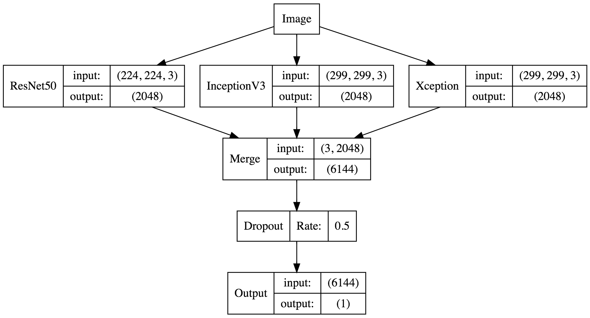
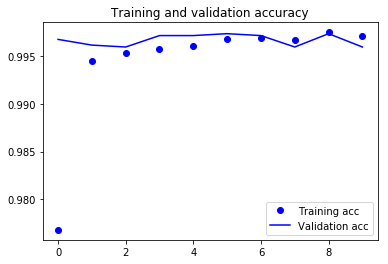
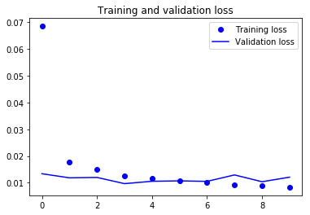

## Visualizations
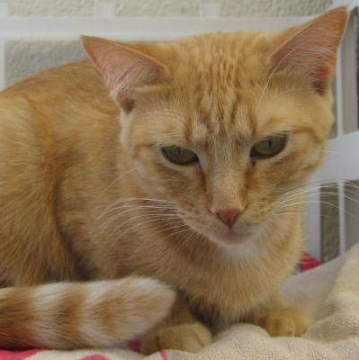
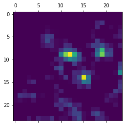
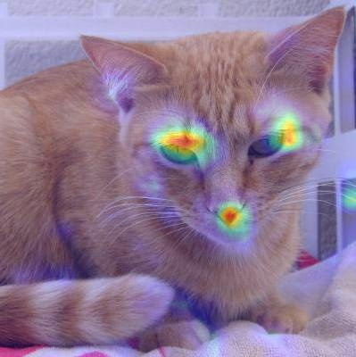

## Report
Click here to view the Chinese version report [(PDF)](https://github.com/ViolinLee/Project_Dogs_vs_Cats/blob/master/Report_dogs_vs_cats.pdf).